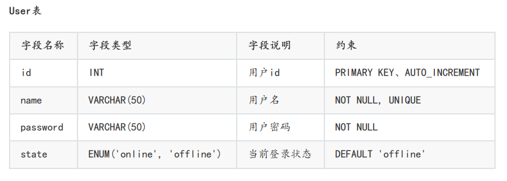
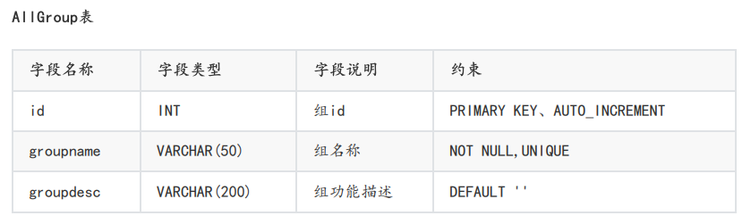
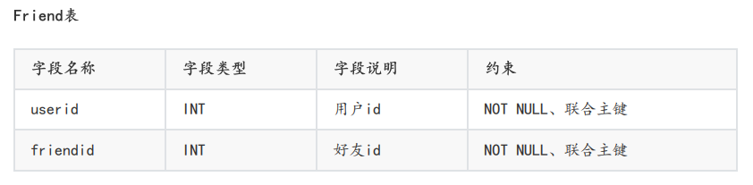
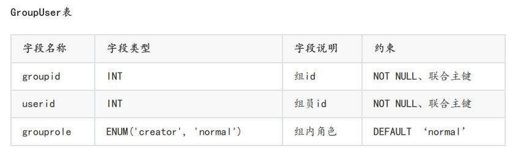
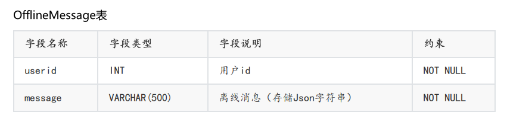

此次服务器项目使用MySQL数据库作为聊天数据的落地存储。

## 聊天程序基本必要的信息：

- 用户信息

  - 登录、注册、添加好友都需要查询用户信息

- 群组信息

  - 创建群、加入群、群聊天需要使用群的信息以及用户的信息

- 离线消息

  - 当用户处于离线状态，但其好友发送了消息，此消息称为离线消息。这里因为方便，我们也使用MySQL进行存储

## 表的设计：

- **User表**：保存用户信息的表。用于唯一标识用户的id（主键、自增）、用户姓名、用户密码、用户登录状态

- **AllGroup表：** 保存群信息的表。用于唯一标识群的id（主键、自增）、群的名称、群的描述

- **Friend表：** 表明好友关系的表。用户id，用户的好友friendid。

  - 为了避免好友关系的重复，这里将id和friendid设置为联合主键。例如，id为5其好友friendid为13，等价于id为13其好友friendid为5。

- **GroupUser表：** 表明群和用户之间关系的表。群的groupid，用户userid，以及用户在群中的角色。同样地，群与用户设置为联合主键避免重复

- **OfflineMessage表：** 用户userid，离线消息message。

五个表的关联性如下图所示：
